# Steelbore Bravais — Architecture

## System Architecture Diagram

```mermaid
graph TB
    subgraph FLAKE["flake.nix"]
        direction TB
        INPUTS["Inputs"]
        OUTPUT["nixosConfigurations.bravais"]
    end

    subgraph INPUTS_DETAIL["Flake Inputs"]
        direction LR
        NIXPKGS["nixpkgs<br/>25.11 stable"]
        UNSTABLE["nixpkgs-unstable<br/>bleeding edge"]
        COSMIC_FLAKE["nixos-cosmic"]
        HM["home-manager<br/>release-25.11"]
        EMACS["emacs-ng"]
    end

    INPUTS --> INPUTS_DETAIL

    OUTPUT --> HOST
    OUTPUT --> MODULES
    OUTPUT --> COSMIC_MOD["nixos-cosmic module"]
    OUTPUT --> HM_MOD["home-manager module"]

    subgraph HOST["hosts/bravais/"]
        direction TB
        HOST_DEF["default.nix<br/>━━━━━━━━━━━━━<br/>Hostname: bravais<br/>NetworkManager<br/>User: mj<br/>Shell: nushell<br/>steelbore.* toggles"]
        HW["hardware.nix<br/>━━━━━━━━━━━━━<br/>ext4 + vfat<br/>Intel KVM<br/>NVMe/USB storage"]
        HOST_DEF --> HW
    end

    subgraph HOME["users/mj/"]
        direction TB
        USER_SYS["default.nix<br/>━━━━━━━━━━━━━<br/>User account<br/>Groups: wheel, docker"]
        USER_HM["home.nix<br/>━━━━━━━━━━━━━<br/>Git + GPG signing<br/>Starship prompt<br/>Nushell config<br/>Alacritty theme<br/>Niri/Ironbar dots"]
    end

    HM_MOD --> USER_HM

    subgraph MODULES["modules/"]
        direction TB

        subgraph CORE["core/"]
            direction TB
            CORE_DEF["default.nix"]
            BOOT["boot.nix<br/>systemd-boot<br/>XanMod kernel"]
            NIX["nix.nix<br/>Flakes enabled<br/>Weekly GC<br/>Overlays"]
            LOCALE["locale.nix<br/>UTC timezone<br/>en_US.UTF-8"]
            AUDIO["audio.nix<br/>PipeWire<br/>No PulseAudio"]
            SECURITY["security.nix<br/>sudo-rs<br/>polkit"]
        end

        subgraph THEME["theme/"]
            direction TB
            THEME_DEF["default.nix<br/>━━━━━━━━━━━━━<br/>STEELBORE_* vars<br/>TTY hex colors"]
            FONTS["fonts.nix<br/>━━━━━━━━━━━━━<br/>Orbitron<br/>JetBrains Mono<br/>Share Tech Mono<br/>Nerd Fonts"]
        end

        subgraph DESKTOPS["desktops/"]
            direction TB
            DESK_DEF["default.nix"]
            GNOME["gnome.nix<br/>━━━━━━━━━━━━━<br/>GNOME Wayland<br/>Extensions<br/>De-bloated"]
            COSMIC["cosmic.nix<br/>━━━━━━━━━━━━━<br/>COSMIC DE<br/>30+ cosmic-* pkgs<br/>No cosmic-greeter"]
            NIRI["niri.nix<br/>━━━━━━━━━━━━━<br/>Niri WM<br/>anyrun, ironbar<br/>config.kdl<br/>Steelbore theme"]
            LEFTWM["leftwm.nix<br/>━━━━━━━━━━━━━<br/>LeftWM X11<br/>rlaunch, polybar<br/>config.ron<br/>picom, dunst"]
        end

        subgraph LOGIN["login/"]
            direction TB
            LOGIN_DEF["default.nix"]
            GREETD["greetd.nix<br/>━━━━━━━━━━━━━<br/>greetd service<br/>tuigreet<br/>Session selector"]
        end

        subgraph HARDWARE["hardware/"]
            direction TB
            HW_DEF["default.nix"]
            INTEL["intel.nix<br/>━━━━━━━━━━━━━<br/>kvm-intel<br/>x86-64-v4 flags<br/>Microcode"]
            FINGER["fingerprint.nix<br/>━━━━━━━━━━━━━<br/>fprintd"]
        end

        subgraph PACKAGES["packages/"]
            direction TB
            PKG_DEF["default.nix"]
            PKG_LIST["10 Categories:<br/>browsers, terminals<br/>editors, development<br/>security, networking<br/>multimedia, productivity<br/>system, ai"]
        end
    end

    subgraph PALETTE["Steelbore Palette"]
        direction LR
        P1["#000027<br/>Void Navy"]
        P2["#D98E32<br/>Molten Amber"]
        P3["#4B7EB0<br/>Steel Blue"]
        P4["#50FA7B<br/>Radium Green"]
        P5["#FF5C5C<br/>Red Oxide"]
        P6["#8BE9FD<br/>Liquid Coolant"]
    end

    THEME_DEF --> PALETTE

    subgraph LOGIN_FLOW["Login Flow"]
        direction LR
        GREETD_SVC["greetd"] --> TUIGREET["tuigreet"]
        TUIGREET --> SEL{"Session<br/>Selector"}
        SEL -->|1| NIRI_SESS["Niri<br/>(Default)"]
        SEL -->|2| COSMIC_SESS["COSMIC"]
        SEL -->|3| GNOME_SESS["GNOME"]
        SEL -->|4| LEFT_SESS["LeftWM"]
    end

    GREETD --> LOGIN_FLOW

    style FLAKE fill:#000027,stroke:#4B7EB0,color:#D98E32
    style HOST fill:#0a0a3a,stroke:#4B7EB0,color:#D98E32
    style MODULES fill:#0a0a3a,stroke:#4B7EB0,color:#D98E32
    style HOME fill:#0a0a3a,stroke:#4B7EB0,color:#D98E32
    style PACKAGES fill:#111144,stroke:#4B7EB0,color:#D98E32
    style DESKTOPS fill:#111144,stroke:#4B7EB0,color:#D98E32
    style CORE fill:#111144,stroke:#4B7EB0,color:#D98E32
    style THEME fill:#111144,stroke:#4B7EB0,color:#D98E32
    style LOGIN fill:#111144,stroke:#4B7EB0,color:#D98E32
    style HARDWARE fill:#111144,stroke:#4B7EB0,color:#D98E32
    style PALETTE fill:#000027,stroke:#D98E32,color:#D98E32
    style LOGIN_FLOW fill:#0a0a3a,stroke:#50FA7B,color:#D98E32
    style INPUTS_DETAIL fill:#111144,stroke:#4B7EB0,color:#8BE9FD
```



---

## Data Flow

```text
┌─────────────────────────────────────────────────────────────────────────────┐
│                              flake.nix                                       │
│  ┌──────────────────┐  ┌──────────────────┐  ┌────────────────────────────┐ │
│  │     nixpkgs      │  │    unstable      │  │     External Flakes        │ │
│  │   (25.11 stable) │  │   (bleeding)     │  │  nixos-cosmic, emacs-ng    │ │
│  │                  │  │                  │  │  home-manager              │ │
│  │   ~150 pkgs      │  │   ~26 pkgs       │  │                            │ │
│  └────────┬─────────┘  └────────┬─────────┘  └─────────────┬──────────────┘ │
│           │                     │                          │                │
│           └─────────────────────┼──────────────────────────┘                │
│                                 ▼                                           │
│               ┌─────────────────────────────────────┐                       │
│               │    nixosConfigurations.bravais      │                       │
│               │    specialArgs: unstable, emacs-ng  │                       │
│               │                steelborePalette     │                       │
│               └─────────────────┬───────────────────┘                       │
└─────────────────────────────────┼───────────────────────────────────────────┘
                                  │
           ┌──────────────────────┼──────────────────────┐
           ▼                      ▼                      ▼
  ┌─────────────────┐   ┌─────────────────┐   ┌─────────────────┐
  │  hosts/bravais  │   │    modules/     │   │  home-manager   │
  │                 │   │                 │   │                 │
  │ • Hostname      │   │ core/           │   │ users/mj/       │
  │ • User account  │   │ • boot          │   │ • Git + GPG     │
  │ • steelbore.*   │   │ • nix           │   │ • Starship      │
  │   toggles       │   │ • locale        │   │ • Nushell       │
  │ • Hardware      │   │ • audio         │   │ • Alacritty     │
  │                 │   │ • security      │   │ • Niri dots     │
  └─────────────────┘   │                 │   │ • Ironbar dots  │
                        │ theme/          │   └─────────────────┘
                        │ • colors        │
                        │ • fonts         │
                        │                 │
                        │ desktops/       │
                        │ • gnome         │
                        │ • cosmic        │
                        │ • niri          │
                        │ • leftwm        │
                        │                 │
                        │ login/          │
                        │ • greetd        │
                        │                 │
                        │ hardware/       │
                        │ • intel         │
                        │ • fingerprint   │
                        │                 │
                        │ packages/       │
                        │ • 10 categories │
                        └─────────────────┘
```

---

## Module Design Pattern

All modules follow the `steelbore.*` namespace pattern with `lib.mkEnableOption`:

```nix
# Example: modules/desktops/niri.nix
{ config, lib, pkgs, unstable, steelborePalette, ... }:

{
  options.steelbore.desktops.niri = {
    enable = lib.mkEnableOption "Niri scrolling tiling compositor (Wayland)";
  };

  config = lib.mkIf config.steelbore.desktops.niri.enable {
    programs.niri.enable = true;

    environment.systemPackages = with pkgs; [
      niri
      ironbar
      unstable.anyrun    # From unstable channel
      # ...
    ];

    # Declarative configuration with Steelbore palette
    environment.etc."niri/config.kdl".text = ''
      layout {
        focus-ring {
          active-color "${steelborePalette.moltenAmber}"
          inactive-color "${steelborePalette.steelBlue}"
        }
      }
    '';
  };
}
```

---

## Dual Channel Strategy

Bravais uses a dual-channel approach for package sourcing:

| Channel | Purpose | Examples |
|---------|---------|----------|
| **nixpkgs (25.11)** | Stable base, proven packages | Core system, most Rust tools |
| **unstable** | Bleeding-edge, fast-moving | Browsers, AI tools, XanMod kernel |

```nix
# In flake.nix
specialArgs = {
  inherit unstable emacs-ng steelborePalette;
};

# In modules
{ config, lib, pkgs, unstable, ... }:
environment.systemPackages = [
  pkgs.alacritty           # From stable
  unstable.google-chrome   # From unstable
];
```

---

## Security Architecture

```text
┌─────────────────────────────────────────────────────────────┐
│                    Security Stack                            │
├─────────────────────────────────────────────────────────────┤
│  ┌─────────────┐  ┌─────────────┐  ┌─────────────────────┐  │
│  │  sudo-rs    │  │   polkit    │  │  Sequoia PGP Stack  │  │
│  │  (Rust)     │  │             │  │  (Rust)             │  │
│  │             │  │             │  │                     │  │
│  │ Replaces    │  │ Privilege   │  │ sequoia-sq          │  │
│  │ C sudo      │  │ escalation  │  │ sequoia-chameleon   │  │
│  │ Memory-safe │  │ GUI apps    │  │ sequoia-wot         │  │
│  └─────────────┘  └─────────────┘  └─────────────────────┘  │
│                                                              │
│  ┌─────────────┐  ┌─────────────┐  ┌─────────────────────┐  │
│  │    age      │  │    rbw      │  │      sbctl          │  │
│  │  (Rust)     │  │   (Rust)    │  │     (Rust)          │  │
│  │             │  │             │  │                     │  │
│  │ Modern      │  │ Bitwarden   │  │ Secure Boot         │  │
│  │ encryption  │  │ CLI client  │  │ management          │  │
│  └─────────────┘  └─────────────┘  └─────────────────────┘  │
└─────────────────────────────────────────────────────────────┘
```

---

## Desktop Session Flow

```text
                              System Boot
                                   │
                                   ▼
                         ┌─────────────────┐
                         │     greetd      │
                         │    service      │
                         └────────┬────────┘
                                  │
                                  ▼
                         ┌─────────────────┐
                         │    tuigreet     │
                         │  Login Screen   │
                         └────────┬────────┘
                                  │
                    ┌─────────────┼─────────────┐
                    │             │             │
                    ▼             ▼             ▼
           ┌────────────┐ ┌────────────┐ ┌────────────┐
           │   Niri     │ │  COSMIC    │ │   GNOME    │
           │ (Wayland)  │ │ (Wayland)  │ │ (Wayland)  │
           └─────┬──────┘ └─────┬──────┘ └─────┬──────┘
                 │              │              │
         ┌───────┴───────┐     ...            ...
         │               │
         ▼               ▼
    ┌─────────┐    ┌──────────┐
    │ ironbar │    │  wired   │
    │  (bar)  │    │ (notify) │
    └─────────┘    └──────────┘

                         ┌────────────┐
                         │  LeftWM    │
                         │   (X11)    │
                         └─────┬──────┘
                               │
                    ┌──────────┼──────────┐
                    ▼          ▼          ▼
              ┌─────────┐ ┌─────────┐ ┌─────────┐
              │ polybar │ │  picom  │ │  dunst  │
              │  (bar)  │ │ (comp)  │ │ (notify)│
              └─────────┘ └─────────┘ └─────────┘
```

---

## Theme Propagation

The Steelbore palette propagates through all layers:

```text
flake.nix (steelborePalette)
         │
         ├──► modules/theme/default.nix
         │         │
         │         ├──► Environment variables (STEELBORE_*)
         │         └──► TTY console colors
         │
         ├──► modules/desktops/niri.nix
         │         │
         │         ├──► config.kdl (focus ring colors)
         │         └──► ironbar/style.css
         │
         ├──► modules/desktops/leftwm.nix
         │         │
         │         ├──► theme.ron (border colors)
         │         ├──► polybar.ini
         │         └──► dunstrc
         │
         ├──► modules/packages/terminals.nix
         │         │
         │         ├──► alacritty.toml
         │         ├──► wezterm.lua
         │         └──► rio/config.toml
         │
         └──► users/mj/home.nix
                   │
                   ├──► Starship prompt palettes
                   ├──► Alacritty colors
                   └──► XDG config files
```
